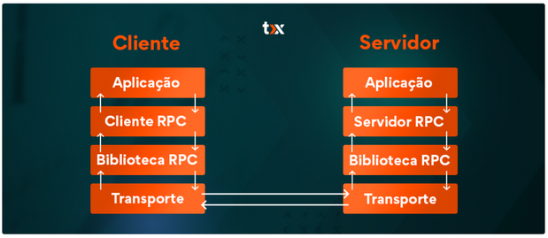
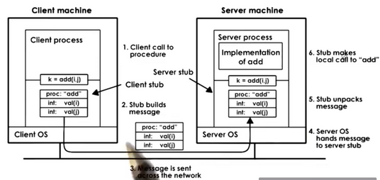

# xRPC

*RPC - REMOTE PROCEDURE CALL*

## Definição RPC e gRPC

### RPC (REMOTE PROCEDURE CALL)

É um protocolo de comunicação, que permite que um **cliente solicite serviços para um servidor**, sendo que ambos estão em redes diferentes.

O RPC é importante pois consegue, através de interfaces (stubs) diferentes (cliente-servidor), realizar **comunicação para sistemas distribuídos**.

Um exemplo de uma visão macro do processo de comunicação entre um cliente e um servidor é mostrado na Figura 1.

<!--  -->

<figure>
  
  <figcaption >Figura 1: Visão macro comunicação RPC cliente-servidor.</figcaption>
</figure>

Enquanto que um exemplo prático de chamada de subrotina entre um cliente e um servidor é mostrado na Figura 2.

<figure>
  
  <figcaption >Figura 2: Visão macro comunicação RPC cliente-servidor.</figcaption>
</figure>

### gRPC 

É uma estrutura de comunicação, que **permite a troca de dados**, entre serviços, aplicativos e dispositivos.
(**gRPC**)